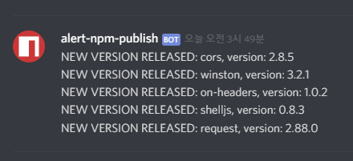
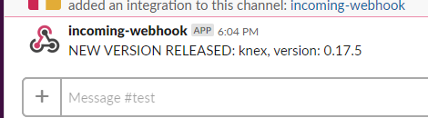

# alert-npm-publish

alert when new version of whitelisted package is published




support Node.js 10+

### example

```
WEBHOOK_URL=<your_webhook_url> node index.js -t slack -c "0 0 0 * * *" -f ./watchlist.json
```

you can customize your `watchlist.json`.

### options

* `-t` || `--type=` : type of webhook. Currently support slack and discord.
* `-c` || `--cron=` : custom cron timer. `h` and `d` is predefined.
* `-f` || `--file=` : filename of package <-> version mapping json. Update by this program to maintain version as lastest.
